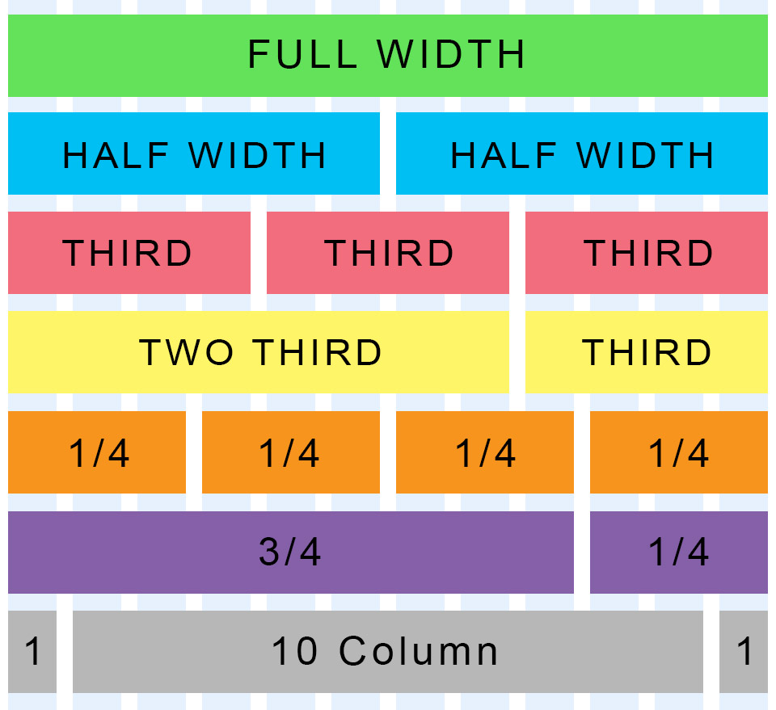

#Layout With HTML and CSS
-
##Quick Warmup
- Let's use Codepen.io to practice CSS selectors.
- Create at least one div with an id, and four divs with a class.
- Use CSS to apply styling to the divs based on the id and class selectors.
- Bonus: Try implementing one or more styles using a CSS3 selector (first-child, nth-child, first-of-type, etc).

##Floats
- Floating elements allows us to create a nearly unlimited number of layouts using all types of block elements.
- Floating an element essentially removes it from the standard "flow" and places it to the left or right side of its container.
- Elements can have fixed width, which will wrap underneath each other if the container is smaller than the combined widths.
- You can also used percentage width, which will have the columns respond to the screen size.
- You can tell already that the calculations can get out of hand really fast...

##The Grid Layout
- Most modern layouts operate on a standard 12-column grid system.
- If you break down any of the websites you know and love you will notice many variations on the 12 column grid.
- Each column in the grid can contain nested grids itself.
- If you want a larger box, you need to have a greater column offset.
- Grid sizes can be thought of in terms of grid place offsets. For example, two blocks of content next to each other is two columns of 6. 4 across is an offset of 3.
- Grid offset numbers must add up to 12.
- Here is a good pictorial to help you break it down:


##Group Exercise
- In groups of two, look up one website of your choice.
- Think about the layout they chose in terms of the grid system.
- Write down which column "offsets" were likely used, and where nested grids may be present.

##Code-Along: Let's Create Our Own Grid
- We will create a 2, 4, and 6 column grid.

##CSS Media Queries
- Media queries allow you to apply and remove CSS styling based on the screen dimensions.
- This is important to create truly mobile-friendly layouts.
- To use it you have to specify screen resolution thresholds.
- Let's try an example where we want to show a div where the screen size is larger than 700 pixels:

HTML

` <div id="my-div"></div> `

CSS

```
@media(min-width: 700px) {
    #my-div {
        width:400px;
        height:400px;
        border:#000 1px solid;
    }
}

```
- Now where the screen size is below 700 pixels:

CSS

```
@media(max-width: 700px) {
    #my-div {
        width:400px;
        height:400px;
        border:#000 1px solid;
    }
}

```

- You can also combine these values to select a range:

```
@media(min-width: 700px) and (max-width: 900px) {
    #my-div {
        width:400px;
        height:400px;
        border:#000 1px solid;
    }
}

```
- Good news! Bootstrap does this for you!

##Twitter Bootstrap
- Advanced layout doesn't have to mean hard layout.
- Most of the difficult work done with layout is done using frameworks.
- Frameworks remove many burdens to frontend development including generic grids, mobile responsiveness via media queries, and starter UI elements.
- Bootstrap is a front-end framework that incorporates a grid system, UI components, JavaScript widgets and more.
- Let's take a look at the documentation: [http://getbootstrap.com/](http://getbootstrap.com/).
- The framework consists of one main CSS file, an optional theme CSS file, and a main JS file.
- Bootstrap requires jQuery to work, which is a JavaScript framework.

##Using Bootstrap
- To use Bootstrap you have to include the three required files.
- Bootstrap files can be linked via the CDN provided, or downloaded locally onto the computer.
- Remember to place your reference to the jQuery library above your reference to the Boostrap JS code.

##Bootstrap Columns
- Columns are written in this format as a class attribute: col-(breakpoint)-(offset).
- An example of a three-column layout may be to use the class col-sm-4.
- All columns should be wrapped into an element with a class of row.
- So the complete three-column layout may look something like this:

```
<div class="row">
    <div class="col-sm-4">
        Content Here
    </div>
    <div class="col-sm-4">
        Content Here
    </div>
    <div class="col-sm-4">
        Content Here
    </div>
</div>

```
##Breakpoints
- The way that Bootstrap works is to dynamically reduce column size according to the window size.
- To be mobile-friendly, the columns will break into a stack layout after a minimum width is detected.
- The breakpoints you can select in your columns control at which point this happens.
- Check out their documentation [here](http://getbootstrap.com/css/#grid) to see what these breakpoints are in terms of size.

##Code-Along
- Let's create columns using Bootstrap. 
- Let's also make sure to practice using different breakpoints.

##UI Elements
- Bootstrap wraps in a myriad of great UI elements that you can drop in anywhere on your site.
- With Bootstrap you can make really pretty things quickly.
- Let's look at some [examples](http://getbootstrap.com/components/).

##Putting it Together
- Let's take a look at some of the bootstrap examples located [here](http://getbootstrap.com/getting-started/#examples).
- We will code together the "Jumbotron Narrow" template located [here](http://getbootstrap.com/examples/jumbotron-narrow/).
- Before we start, let's also plan out our grid system.